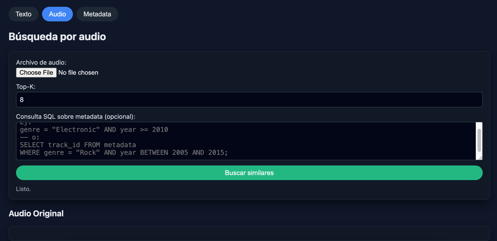

# Proyecto 2: Base de Datos 2

| Integrante | % de Participación |
| ---------- | ------------------ |
| Margiory Alvarado Chavez | 100%         |
| Yofer Corne Flores  | 100%               |
| Diana Ñañez Andrés | 100%               |
| Jesús Velarde Tipte | 100%               |
| Franco Roque Castillo | 100%               |

---

## Introducción
### Contexto del Proyecto
Vivimos en una época donde la información crece exponencialmente, pero gran parte de ella es **"caos"**: datos no estructurados que no caben en las filas de una base de datos tradicional. Imágenes, audios, textos libres y videos componen la mayor parte del mundo digital. Entonces, ¿cómo podemos organizar, indexar y recuperar esta información de manera eficiente cuando los métodos clásicos (como SQL) ya no son suficientes?

Para abordar este proyecto, nos hemos centrado en el **dominio musical**, un escenario ideal que combina dos mundos complejos: el lenguaje humano (las letras) y las señales acústicas (el sonido).

### Dominio de Datos
Nuestro sistema gestiona una Base de Datos Multimodal que integra:
1.  **Texto (Semántica):** Procesamos las letras (*lyrics*) y metadatos de las canciones. Aquí el reto no es solo encontrar una palabra exacta, sino entender el contenido textual para realizar búsquedas relevantes por frases o temáticas.
2.  **Audio (Contenido Acústico):** Analizamos la señal de audio pura. En lugar de buscar por el nombre del archivo, extraemos las "huellas digitales" sonoras (características acústicas) de cada canción para permitir búsquedas por similitud musical.

### Justificación: ¿Por qué una Base de Datos Multimodal?
Las bases de datos relacionales tradicionales son herramientas perfectas para búsquedas deterministas (ej. *"Dame la canción con ID 404"*). Sin embargo, fallan estrepitosamente ante consultas humanas y difusas, como *"búscame canciones que hablen de amor en tiempos de guerra"* o *"encuéntrame algo que suene parecido a esta pista"*.

La necesidad de este proyecto radica en la implementación de técnicas de **Recuperación de Información (Information Retrieval)**. Al construir índices especializados (invertidos para texto y vectoriales para audio), logramos un sistema capaz de "entender" el contenido. Esto nos permite ofrecer una experiencia de búsqueda mucho más rica y natural, superando las limitaciones de la búsqueda simple por palabras clave o filtros exactos.

---

## Objetivos

### Objetivo General
Diseñar, construir y validar una **Base de Datos Multimodal** orientada a la recuperación eficiente de información por contenido. El sistema debe integrar algoritmos propios de indexación para texto y audio, permitiendo consultas rápidas y precisas sobre grandes volúmenes de datos.

### Objetivos Específicos
1.  **Implementar Indexación Textual Eficiente:** Desarrollar un índice invertido utilizando la técnica **SPIMI** (Single-Pass In-Memory Indexing) para procesar y organizar miles de documentos textuales sin saturar la memoria RAM, habilitando búsquedas de texto completo de alto rendimiento.
2.  **Desarrollar Recuperación por Similitud de Audio:** Construir un "diccionario acústico" (mediante técnicas de **K-Means** y **Bag of Words**) que transforme señales de audio complejas en vectores (histogramas) comparables matemáticamente.
3.  **Diseñar una Interfaz de Usuario (Frontend):** Crear una aplicación gráfica intuitiva que oculte la complejidad matemática al usuario, permitiéndole realizar consultas textuales y visuales (drag-and-drop) de forma sencilla.
4.  **Evaluación Crítica de Desempeño:** Someter el sistema a pruebas de escalabilidad (hasta 64,000 registros) y comparar nuestros algoritmos frente a soluciones de industria como **PostgreSQL** (con índices GIN y HNSW), analizando objetivamente los tiempos de respuesta y la precisión de los resultados.

---

## Arquitectura del Proyecto
(podemos poner un gráfico del procedimiento del proyecto)

---

## Índice Invertido para Texto
### Preprocesamiento
- Tokenización  
- Eliminación de stopwords  
- Limpieza de signos  
- Stemming  

### Construcción del Índice Invertido
- Se realizó el cálculo de TF-IDF (Term Frequency-Inverse Document Frequency)
- Cálculo de norma del documento (aqui faltaria explicar junto con el SPIMI)
- Construcción mediante SPIMI (Single-Pass In-Memory Indexing)
- Merge Blocks utilizando B buffers


### Motor de Consulta
- Entrada: consulta en lenguaje natural
- Scoring hallada con similitud de coseno
- Recuperación del Top-K sin cargar todo el índice en memoria RAM.

### Comparación con PostgreSQL
- Para el proyecto compararemo nuestros resultados con el índice GIN de PostgreSQL.
- Estrategia de ranking (ts_rank, ts_rank_cd, etc.) manejando también **tsquery** y **tsvector**


---

## Índice Invertido para Descriptores Locales para audio
### Extracción de Características
Fue realizado con MFCC (de ahi le pongo más contexto)

### Construcción del Diccionario Acústico
La construcción del diccionario acústico se inicia aplicando el algoritmo K-Means sobre el conjunto de descriptores locales extraídos de los audios de ***FMA: A Dataset For Music Analysis***. Cada descriptor es asignado al clúster más cercano y el centroide resultante representa una acoustic word.

Una vez finalizado el proceso de agrupamiento, el diccionario queda conformado por todos los centroides obtenidos, esto permite mapear cualquier nuevo vector de características hacia una palabra del vocabulario acústico. Finalmente, cada objeto sonoro es representado mediante un histograma que cuantifica la frecuencia relativa de aparición de estas acoustic words dentro del audio, logrando así una representación compacta y comparable que habilita las tareas de recuperación por similitud.

### Búsqueda KNN
| Algoritmo | Descripción |
|----------|-------------|
| KNN Secuencial | Comparación coseno entre histogramas |
| KNN con Indexación Invertida | Optimización basada en codewords + TF-IDF + heap |

## Fronted

El frontend fue desarrollado utilizando Qt para Python, priorizando la usabilidad y la interacción intuitiva con los motores de búsqueda textual y multimedia implementados en el backend. La interfaz cuenta con **dos ventanas** independientes: una destinada a la recuperación basada en texto y otra orientada a la búsqueda de audios. En ambos casos, la aplicación ofrece elementos interactivos que permiten ejecutar querys de manera dinámica. En la ventana de texto, el usuario puede ingresar una consulta libre en un cuadro de texto, seleccionar el valor de Top-K y elegir el tipo de algoritmo de recuperación mediante una barra lateral configurable. Tras la ejecución, los resultados son presentados en un panel que muestra los outputs en lo que se refleja la metadata y la información relevante de cada documento recuperado.

La ventana dedicada a audio replica esta estructura general, pero adaptada al dominio multimedia. El usuario puede cargar un archivo de consulta desde su sistema local y especificar los parámetros para la búsqueda por similitud. Una vez mostrados los resultados, la interfaz permite seleccionar cualquiera de los audios retornados y reproducirlo directamente, lo que facilita la validación subjetiva y objetiva de la similitud entre el archivo de consulta y los elementos recuperados. Esta organización del fronted habilita un flujo de interacción funcional con ambos sistemas de recuperación basados en contenido.

### Ejecución del Frontend

Para levantar la aplicación se deben iniciar primero los servicios de backend (APIs) y luego el servidor del frontend.  
La ejecución recomendada es en el siguiente orden, desde la carpeta raíz del proyecto:

- **API de audio**  
  ```bash
  python3 -m uvicorn api.main:app
  ```
- **API de texto**
  ```bash
  python3 -m uvicorn api2.main2:app --port 8002
  ```
- **Fronted**
  ```bash
  python3 -m uvicorn frontend.web_frontend:app --port 8001
  ```

Una vez levantados los tres servicios, se puede acceder a la pantalla principal de la aplicación desde el navegador en http://127.0.0.1:8001.
--

## Pantallas de la aplicación

### Pantalla de búsqueda por texto


### Pantalla de búsqueda por audio


### Pantalla de metadata del track


## Análisis Comparativo

## Experimento 1: Búsqueda en Texto (PostgreSQL vs. Implementación Propia)

En esta parte quisimos ver qué tan rápido es nuestro buscador comparado con PostgreSQL. Hicimos varias pruebas aumentando la cantidad de canciones (N) poco a poco, desde 2,000 hasta 32,000, para ver si el sistema aguantaba.

### ¿Cómo configuramos PostgreSQL?
Probamos con dos tipos de índices de Postgres para poder ver cuál funciona mejor para nuestro proyecto:
* **GIN:** Es un índice especialista en texto. Es buenísimo para hacer búsquedas rápidas en datos que no cambian a cada rato (como las letras de canciones).
* **GiST:** Es otro tipo de índice que sirve más para datos geométricos o búsquedas aproximadas. Es rápido para *guardar* datos nuevos, pero vimos que es más lento para *leerlos*.

**¿Por qué elegimos GIN?**
Hicimos una "comparación" entre los dos con 32,000 canciones y la diferencia fue:
* **Con GiST:** Tardaba unos ~0.1471 segundos.
* **Con GIN:** Tardaba apenas ~0.0009 segundos.

Básicamente, **GIN resultó ser 160 veces más rápido**. Como en este proyecto nos interesa que el usuario encuentre la canción al instante (y no vamos a estar cambiando las letras de las canciones a cada rato), decidimos quedarnos con GIN para la arquitectura final.

**¿Cómo funciona la búsqueda por dentro?**
PostgreSQL no busca letra por letra. Lo que hace es "limpiar" el texto de la canción (quita palabras de relleno, plurales, etc.) y lo convierte en algo llamado `tsvector`. Cuando el usuario busca algo, su consulta se transforma en `tsquery` y se compara con esos vectores. Para decidir qué canción sale primero en la lista, usa una función llamada `ts_rank`, que le da puntaje a los resultados dependiendo de qué tan frecuente aparece la palabra buscada en la canción.
### Resultados de Rendimiento (Texto)

| Tamaño de la colección (N) | MyIndex (Python) | PostgreSQL (GIN) |
|---------------------------|------------------|------------------|
| N = 2000                  | *pendiente* | **0.000686 s** |
| N = 4000                  | *pendiente* | **0.000773 s** | 
| N = 8000                  | *pendiente* | **0.000791 s** | 
| N = 16000                 | *pendiente* | **0.000821 s** |
| N = 32000                 | *pendiente* | **0.000917 s** |

> **Análisis:** El índice GIN mantiene un tiempo de respuesta casi constante (sub-milisegundo) incluso al duplicar el volumen de datos, demostrando una escalabilidad logarítmica ideal para este tipo de aplicaciones.

## Experimento 2: Búsqueda de Audio (Buscando Canciones Parecidas)

Aquí el reto era diferente. No buscamos palabras, sino "sonidos". Queríamos ver si PostgreSQL era capaz de encontrar canciones que suenen similar a otra (por ejemplo, si le doy una canción de rock, que me devuelva otras de rock) en cuestión de milisegundos.

### ¿Cómo lo hicimos si nos faltaban datos?
Teníamos unas ~8,000 canciones procesadas (histogramas), pero para hacer la comparación con distintos tamaños "clonamos" nuestras canciones reales automáticamente en la base de datos hasta llenar el espacio de 32,000 registros.

### pgVector + HNSW
Para lograr búsquedas de milisegundos, combinamos dos tecnologías clave:
1.  **pgVector:** Permite a PostgreSQL entender y almacenar nuestros histogramas como **vectores matemáticos**, habilitando el cálculo de "distancia" (similitud) entre canciones.
2.  **HNSW (Hierarchical Navigable Small World):** Es el índice que acelera el proceso. En lugar de comparar la consulta contra las 32,000 canciones una por una (búsqueda secuencial), HNSW va a organizar los datos en un **grafo de navegación**. Esto va a permite que el motor pueda "saltar" entre vecinos cercanos para encontrar el resultado casi al instante, sin recorrer toda la base de datos.
### Resultados de Velocidad (Audio)

La diferencia fue increíble. Incluso con 32,000 canciones, la base de datos responde en **casi 1 milisegundo**.

| Tamaño de la colección (N) | KNN-Secuencial | KNN-Indexado | KNN-PostgreSQL (HNSW) |
|---------------------------|----------------|--------------|-----------------------|
| N = 2000                  | *pendiente* | *pendiente* | **0.003123 s** |
| N = 4000                  | *pendiente* | *pendiente* | **0.001308 s** |
| N = 8000                  | *pendiente* | *pendiente* | **0.001528 s** |
| N = 16000                 | *pendiente* | *pendiente* | **0.001373 s** |
| N = 32000                 | *pendiente* | *pendiente* | **0.001176 s** |

> **Dato Curioso:** Si se fijan, buscar entre 32,000 canciones fue más rápido que buscar entre 2,000. Esto pasa por el **"Calentamiento de Caché"**. La primera vez que buscamos (con 2k), la base de datos estaba "fría" y tuvo que leer del disco. Para cuando llegamos a 32k, ya tenía los atajos en la memoria RAM y voló.

## Ejecución del Proyecto
??? aqui me imagino que describimos los pasitos del proyecto
### Requisitos

### Pasos


## Estructura de la Repo

